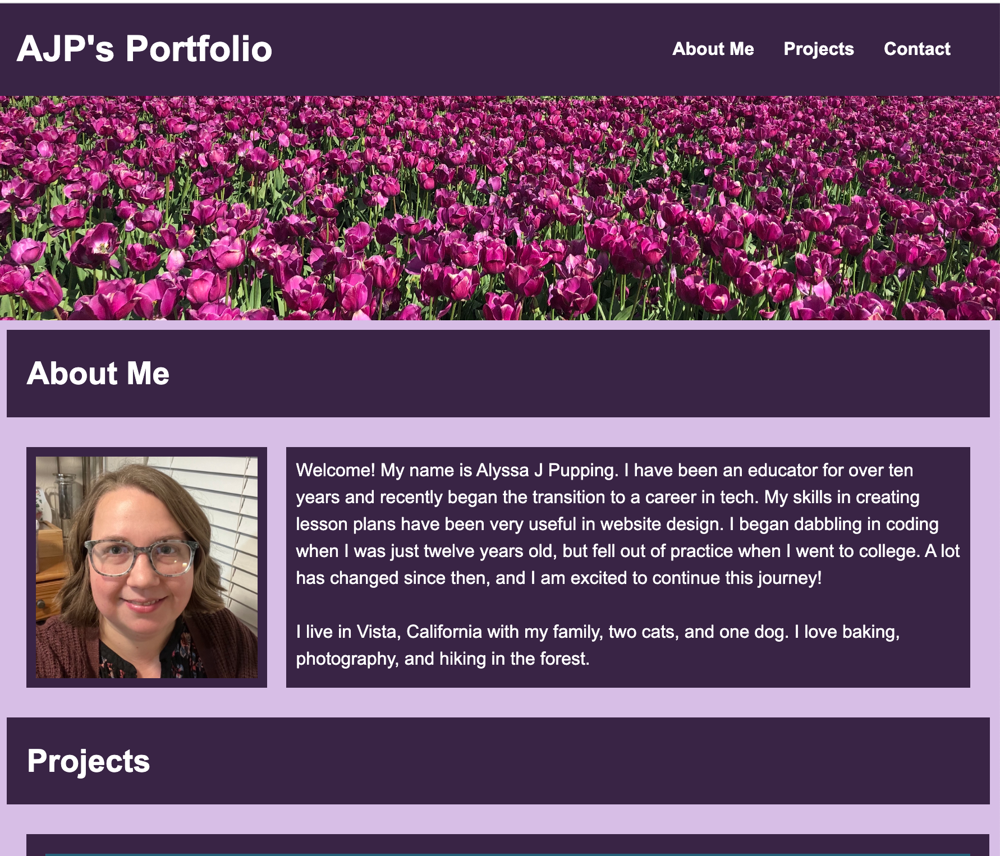

# ajp-portfolio

## Description 

The goal of this project was construct a professional portfolio website where future employers can learn about me and my work.  

The creation of this website will allow me to show off my skills and completed projects. I will be able to update it with new projects as I build them. 

While building this web application, I learned more about CSS flexbox. I learned how to resize and reformat my page to work for mobile devices. I also learned how to keep images from stretching outside the boundaries of the page. 

## Usage

Users who [visit my portfolio](https://ajpupping.github.io/ajp-portfolio/) will find a well organized website with links to a variety of projects. Navigation links allow users to quickly jump to other sections of the page. 

## Credits 

All photos used in this project were taken by me.

I used [this guide](https://www.w3schools.com/css/css3_flexbox.asp) to learn more about CSS flexbox. 

And [this guide](https://codepen.io/craigsoup/pen/JKVVjR) to learn how to add a banner to my page without stretching issues.

And [this guide](https://www.w3schools.com/tags/tryit.asp?filename=tryhtml_link_mailto) to learn how to create an email link.

## License 

This project was created for educational purposes and does not have a license.